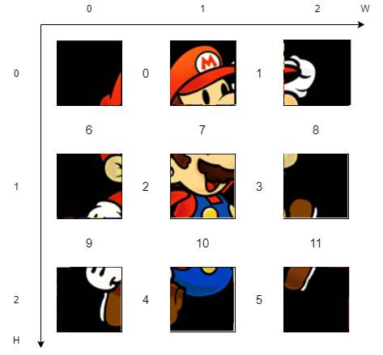

# Mélymegerősítéses tanulás kirakós játékokhoz

## Függőségek telepítése

```
python3 -m build ./puzzle-gym
pip install -e ./puzzle-gym/dist/puzzle_gym-0.0.1.tar.gz
pip install -r requirements.txt
```

## Tanítás indítása

```
python3 ./puzzle_model/train.py
```

## Környezet kipróbálása
```
python3 poc.py
```

### Egy 3x3-as példa az action space-re

A tile-ok közötti szám, mint input, a két szomszédos tile cseréjét eredményezi.

 